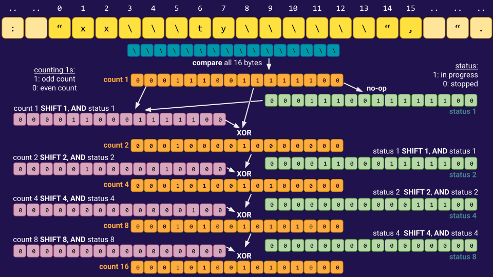

# json-schema-validator

A command line utility written in Rust to validate json-newline files against a schema, fast.

This tool **does not validate that the json is spec-compliant**, rather it validates that the json matches a custom schema.

Test, and then install the `jsonsv` cli util with:

```bash
cargo test
cargo install --path .  
```

Define a schema in a json file like this:

```json
[
    {
      "name": "id",
      "type": "STRING",
      "mode": "REQUIRED"
    },
    ...
]
```

and then validate a `.jsonl` against that schema using the tool:

```bash
jsonsv -f mydata.jsonl -s mydata-schema.json
```

The schema format borrows from the BigQuery format [here](https://cloud.google.com/bigquery/docs/schemas#creating_a_JSON_schema_file), basically you
need to supply at least a `name` and `type` for each field. The supported modes are:

-  `NULLABLE` (default) - field is not required in the json, and if provided it can be `null`.
-  `REQUIRED` - field must be present in the json and cannot be `null`.
-  `REPEATED` - similar to `NULLABLE`, but if the field is non-`null` it must be a json array of the given type.

The supported types are:

- `STRING` - a json string
- `BOOL` - basic json `true`/`false`
- `FLOAT64` - any json number (details not validated).
- `INT64` - a json number without any exponent, between int64 min and max.
- `DECIMAL_29_9` - a json number without an exponent, with up to 29 digits before the decimal point, and up to 9 after (aka BigQuery `NUMERIC`, with default decimal point position)
- `DATE`* - date as a string, without a timezone
- `DATETIME`* - date and time as a string, without a timezone
- `TIME`* - time as a string, without a timezone
- `STRUCT` - a sub schema. In this case you need to provide a `"fields": [...]` property in the schema definition, with a list of sub fields. You can nest arbitrarily deeply, and/or use `REPEATED` mode if needed.
- `ANY` - a unspecified blob of json (could be a scalar json value or a json array/object with arbitray depth).


*the datetime types aren't 100% watertight validators, e.g. `27:30` is treated as valid time, though `37:30` is not.


## Benchmarks

The exact performance will depend a lot on the schema, the data, and the CPU arch, so it's hard to give a really useful benchmark. But as an initial guide, on an M4 Mac, it will validate a 26MB / 11.3k line 
[file](https://github.com/json-iterator/test-data/blob/master/large-file.json) at ~1ms per MB / ~2.4µs per line.
Currently it only supports single threaded excutation (multi threading is hopefully coming soon).

## Internals - what makes it fast?

- It's Rust, so there's no copying by default (and indeed I believe there is indeed no copying). There's also no heap allocation
  after the first iteration or so of the main loop. 
- It uses SIMD for most of the supported types, including the `ANY` type - see section below with diagrams that walks through 
  some of that.
- It avoids unpredictable branches on the happy path as much as possible, even for `null`s, it avoids branching because a
  `null` is still valid (if the schema does not specify `REQUIRED`), and if the data is a random mix of `null`s and real values
  the CPU won't be able to predict what's coming up.
- It avoids recursion - the nested structs are implement with a `Vec` stack rather than recursion. Not sure how much this helps,
  but presumably to some extent.
- For schemas with a small number of keys it uses an optimised field lookup map. Here "small" applies to the top level schema and
  any nested structs separately. Small generally means having no more keys than the number of byte lanes in your CPU's SIMD 
  registers.  The most customised thing here was spun out into a spearate repo 
  [here](https://github.com/d1manson/rust-simd-psmap), though note that the version here is even more tuned for the specific 
  usecase of parsing json.

## SIMD fun - some details

**Starting simple...**

Supppose we have the json string:

```
{“x“: “hello“, “y“: 777, “z“: null}
```

and we've already somehow moved the pointer past the 
`{`, past the first key, `"x"`, and past the `:` and its whitespace. Now we're pointing at the remainder of the string - 
`“hello“, “y“: 777, “z“: null}`. If we load the first 16 bytes into a SIMD lane, we can compare all of them against the char 
(byte) `"`, to get a mask of `1`s/`0`s showing where there is a `"`. Then we can zero out the first byte as that's the opening
quote, leaving the next `1` byte as the closing quote. It is possible to efficiently find the index of that first `1`, in this
case `6`.


We now know that `x` is a string and we know how long that string is. Thus, we can now move the pointer to `,` and continue on
to validate the rest of the json.

**More than one lane's worth...**

Some of the SIMD algorithms can operate on a fixed size, e.g. validating if a the json represents an INT64 (because an INT64 expressed
as a string uses a maximum of 20 characters/bytes). However, other SIMD algorithms need to handle arbitrary length checks. That means
they need to loop over multiple SIMD blocks until the algorithm completes. In the example above, that simply means that we loop until
there is a non-zero value, making sure we track the total number of bytes traversed, i.e. add `16 * (n_loop_iterations - 1)` to the
return value.

**But what about `\"`?...**

Escapes make life more complicated, yes. For example, consider the crazy json snippet:

```
{“str_field”: "xx\\\ty\\\\\\", "...
```
    
Does the value of `str_field` include the `", ` bit or does it end at the last `\`? It turns out we can deal with this in SIMD (well not with pure
SIMD instructions, but SIMD in spirit). The idea is that for each `\`, we want to know whether it's odd or an even within the contiguous
block of `\`s. Then we can ignore any `"` charcters that are preceded by an odd `\`.

The first step is to simply get a mask of `1`s/`0`s showing where there is a `\` character in the block. Now we need to start counting contiguous
blocks of `1`s, or rather counting modulo two. For this kind of even/odd counting, the XOR operation is all we need as if you keep XORing bits
it will simply be `1` when the total number of `1`s encountered is odd, even otherwise.  We can use use shifts of `1`, then `2`, then `4`, and 
then `8` to count the total number of `1`s across the 16 slots. But we also need to stop counting when a contiguous block has come to an end;
thus we track another mask where we AND instead of XORing, but still using shifts of `1`, then `2`, and then `4`.

Now if we carefully do these two sequences in the right order we find we can count, modulo two, how many slashes there are in a contiguous
sequence.



In the example the first contiguous sequence has three `\`s, which get converted to `101`. The second contiguous sequence has six `\`s which
get converted to `101010`. That means the char before the ambiguous `"` is _even_, and thus the ambiguous `"` is the true end of the string.

When looping over multiple blocks of SIMD blocks we need to keep track of an escape "carry" flag so we know whether the first character
in the next block is escaped or not. That carry flag is simply defined by whether the final byte is an odd `\`.

Now you know how to properly jump over a json string using SIMD, as implemented in `src/micro_util.rs@consume_string_generic`.

**Ooh, what about bracket matching with SIMD?..**

Yes, we can!  In JSON there are two kinds of brackets: `[]`  and `{}`.  Even though you can nest one kind within the other (to arbitrary
depth), if you just want to match one open bracket with its closing bracket, you can focus only on brackets of that flavour, ignoring the
other kind entirely (if you are willing to assume the json is valid, which we always do here). The main trick here is going to be doing
a cumulative sum of `+1`s/`-1`s in SIMD, but we will also have to find a way to ignore brackets that appear within strings as those don't
count as real brackets.  Fortunately we've already mostly solved the question of strings in SIMD, so we won't need to itroduce too much
more to deal with that.

```
TODO: more explanation and diagrams. Don't forget to mention the additional carry concepts.
```

Now you know how to jump over an arbitrary json array/object using SIMD, as implemented in `src/micro_util.rs@consume_json_generic`.


**What else?**

That was the most complicated use of SIMD, though we do also use SIMD with a custom map in `src/adaptive_prefix_map.js@SimdPerfectScanMap`.
A slightly simpler verison of that concept exists as a separate [repo](https://github.com/d1manson/rust-simd-psmap), and is documented there 
(as well as with some inline docs here).

The main other use of SIMD is for validating datetimes and numbers. 

The main trick used is to see whether bytes are within a range, e.g. is a given byte `b'0' <= val <= b'9`, but rather than doing it one
char at a time, we do it for the full length of the expected datetime string. Where the string should have specific characters, like `:`,
we can check for equality while still maintaining the inequality SIMD logic -  `b':' <= val <= b':'` - see 
`src/micro_util.rs@consume_within_range` and its usages for details.

A final trick to mention, which is likely only rarely needed, is to decide whether a 19 digit number is an INT64 or too large: the min/max
for an INT64 in decimal form is 19 digits, but only some 19 digit numbers are compatible with INT64. Here we use a variation on the idea
of checking the range: for each position in the 19 digits, we compare against the bound at that position - the first digit can be anything
from 0-9, but if the first digit is a `9`, the second digit can only be `0-2` etc. So for each of the 19 we check if it's strictly-less-than
or strictly-greater-than the bound at that position. The number is then valid if the first strictly-less-than byte comes before the first
strictly-greater-than byte. The positions of these two bytes can be found using SIMD and then trivially compared. See 
`src/micro_util.rs@consume_int64` for details.

## Why?

I wanted to learn Rust and get stuck into some hyper optimisation fun after having worked much higher up in the stack for a 
few years.  If you find the tool useful, or any of the ideas interesting, do let me know - I've licenced it permissively but 
it's always nice to hear from people who like your work ;)!

## TODOs

- [ ] Add tests on the `validate.rs` module itself.
- [ ] Explore more optimisations at the level of the `validate` function itself (to date optmisation has been mostly at lower 
      levels). This will presumably require implementing benchmarks for the function too.
- [ ] Threading.
- [ ] Document some of the SIMD tricks as they were kind of interesting and I'm not sure if anything is novel.
- [ ] Provide some proper benchmarks using other tools.
- [ ] Make sure x86 is sensibly optimised (so far focus has been on Arm Macs / Neon, though it should be ok on x86).
- [ ] Publish it somewhere, to encourage people to actually use it for real.
